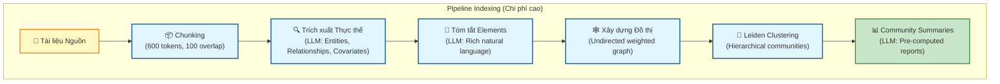
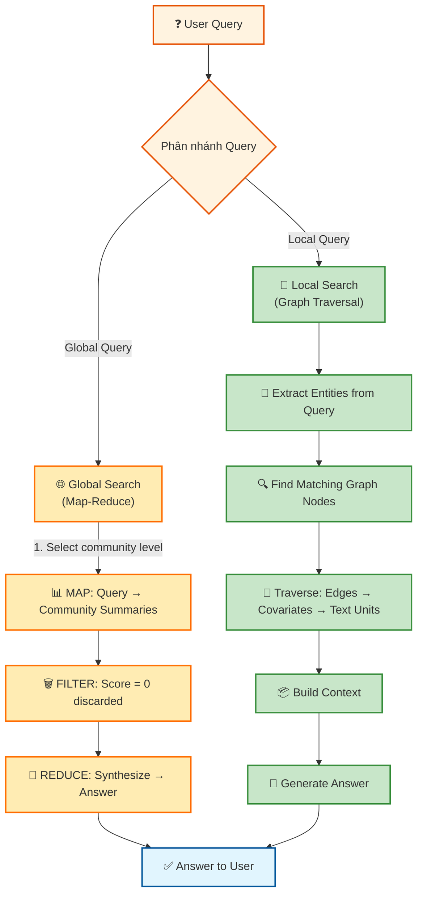

# Từ Vector đến Đồ thị: Làm chủ GraphRAG cho Giải quyết Truy vấn Phức tạp

**Bài giảng chuyên sâu — Chuỗi Lecture Series dành cho Sinh viên Khoa học Máy tính**

---

## 1. TÓM TẮT TỔNG QUAN (Executive Summary)

GraphRAG (Graph Retrieval-Augmented Generation) là một phương pháp tiên tiến kết hợp kiến trúc đồ thị (knowledge graph) với cơ chế Retrieval-Augmented Generation, giúp Large Language Models (LLMs) trả lời các câu hỏi toàn cục trên bộ dữ liệu văn bản lớn một cách toàn diện và đa chiều.

GraphRAG được phát triển bởi Microsoft Research vào năm 2024 (Darren Edge, Ha Trinh, và cộng sự), giải quyết vấn đề cốt lõi của RAG truyền thống: không thể tổng hợp thông tin đa chiều từ hàng triệu token văn bản, trong khi vẫn duy trì hiệu năng truy vấn chấp nhận được.

Bài giảng này sẽ đưa bạn đi sâu vào kiến trúc GraphRAG, từ lý thuyết nền tảng đến áp dụng thực tế cho chatbot tuyển sinh Đại học Khoa học (ĐHKH) của bạn.

---

## 2. TẠI SAO CẦN GRAPHRAG? (The "Why")

### 2.1 Vấn đề của Standard RAG (Naive RAG)

**RAG truyền thống (Naive RAG)** hoạt động theo cơ chế: truy xuất → tìm kiếm vector → tạo câu trả lời.

**Điểm mạnh:**
- Rất hiệu quả cho câu hỏi "needle-in-a-haystack" — ví dụ: *"Điểm chuẩn ngành CNTT năm 2024?"*
- Chi phí indexing thấp (chỉ cần embedding)
- Latency truy vấn nhanh (single LLM call)

**Điểm yếu — The "Middle-Ground Problem":**
- **Không hiểu quan hệ giữa thực thể:** Vector similarity chỉ tìm chunk tương tự, không biết "học phí" liên quan đến "ngành học"
- **Fail ở câu hỏi toàn cục:** *"Các chủ đề chính trong toàn bộ tài liệu tuyển sinh là gì?"* → RAG trả về các chunk ngẫu nhiên chứ không tổng hợp được toàn cảnh
- **Lost in the Middle:** Kể khi có 100 chunk đúng, LLM bỏ qua thông tin ở giữa context window, dẫn đến trả lời thiếu sót

### 2.2 GraphRAG — Giải pháp cho Câu hỏi Phức tạp

| Tiêu chí | Standard RAG (Naive RAG) | GraphRAG |
|-----------|----------------------------|----------|
| **Phương pháp truy xuất** | Vector similarity (cosine) trên text chunks | Graph traversal + Map-Reduce trên community summaries |
| **Loại câu hỏi phù hợp** | Câu hỏi cụ thể, fact-based | Câu hỏi toàn cục, multi-hop, tổng hợp |
| **Xử lý quan hệ giữa thực thể** | Không có — chunk độc lập nhau | Có — edges mô tả quan hệ có ý nghĩa |
| **Khả năng tổng hợp toàn cục** | Yếu — chỉ dựa trên retrieved chunks | Mạnh — pre-computed community summaries |
| **Chi phí indexing** | Thấp (chỉ embedding) | Cao (LLM calls cho extraction + summarization) |
| **Chi phí query** | Thấp (1-2 LLM calls) | Cao (Global: 10+ LLM calls; Local: 1-2 LLM calls) |
| **Chất lượng câu trả lời (global)** | Yếu | Mạnh (tăng 70%+ trên comprehensiveness) |
| **Chất lượng câu trả lời (local/specific)** | Mạnh | Mạnh (tương đương hoặc tốt hơn) |
| **Scalability** | Tốt với dữ liệu lớn | Cần tối ưu hóa (community summaries là key) |

### 2.3 Analogie: Tìm kiếm vs Thủ thư

**Standard RAG = Tra cứu mục lục sách**
- Tìm sách dựa trên từ khóa
- Không biết quyển A liên quan đến quyển B
- Không biết tác giả quyển A còn viết quyển nào khác

**GraphRAG = Hỏi một thủ thư biết mọi mối liên hệ**
- Thủ thư: *"Quyển A và quyển B đều nói về học phí CNTT. Quyển C thì nói học bổng. Bạn cần xem quyển B trước."*
- Kết quả: Tìm được quyển B → từ đó đến quyển C → câu trả lời hoàn chỉnh

---

## 3. KIẾN TRÚC GRAPHRAG — DEEP DIVE (Module 2: Core Architecture)

### 3.1 Pipeline Tổng quan

```
┌─────────────────────────────────────────────────────────────────────────────┐
│                     PIPELINE INDEXING (Chi phí cao)                   │
└─────────────────────────────────────────────────────────────────────────────┘

Tài liệu nguồn
     ↓
Text Chunks (600 tokens, 100 overlap)
     ↓
Element Extraction (LLM): Entities, Relationships, Covariates
     ↓
Element Summarization (LLM): Rich natural language descriptions
     ↓
Graph Construction: Undirected weighted graph
     ↓
Community Detection (Leiden Algorithm): Hierarchical communities
     ↓
Community Summarization (LLM): Pre-computed reports per community

┌─────────────────────────────────────────────────────────────────────────────┐
│                      PIPELINE QUERY (Chi phí thấp hơn)                  │
└─────────────────────────────────────────────────────────────────────────────┘

User Query
     ↓
┌─────────────┴─────────────┐
│   Global Search              │   Local Search
│   (Map-Reduce)              │   (Graph Traversal)
│   ┌───────────────────────┐  │  ┌─────────────────────┐
│   │ 1. Select level      │  │  │ 1. Extract entities  │
│   │    of hierarchy     │  │  │    from query       │
│   │ 2. MAP: Query →      │  │  │ 2. Find matching     │
│   │    each community     │  │  │    graph nodes       │
│   │    summary            │  │  │ 3. Traverse: edges →│
│   │ 3. FILTER: score=0   │  │  │    covariates →      │
│   │    discarded          │  │  │    text units →     │
│   │ 4. REDUCE: concatenate│  │  │    communities      │
│   │    → final answer     │  │  │ 4. Build context    │
│   └───────────────────────┘  │  └─────────────────────┘
└─────────────────┬─────────────┘
                ↓
        Answer to User
```

**Hình 1: Pipeline Indexing GraphRAG**



**Hình 2: Pipeline Query GraphRAG**



### 3.2 Giai đoạn Indexing — Chi tiết

#### Bước 1: Source Documents → Text Chunks

**Decision quan trọng:** Chọn chunk size cân bằng giữa:
- **Quá nhỏ:** Nhiều LLM calls, nhưng entity recall cao
- **Quá lớn:** Ít LLM calls, nhưng entity recall thấp (lost in middle)

**Paper's recommendation:**
- **Optimal:** 600 tokens chunk với 100 tokens overlap
- **Trade-off:**
  - 600 tokens + 1 gleaning: trích xuất ~2x entities
  - 2400 tokens + 0 gleanings: trích xuất ~1x entities

**Pseudocode:**
```python
def chunk_documents(docs: list, chunk_size: int = 600, overlap: int = 100) -> list:
    """
    Chia tài liệu thành các chunks với overlap
    """
    chunks = []
    for doc in docs:
        text = doc['text']
        tokens = tokenize(text)
        for start in range(0, len(tokens), chunk_size - overlap):
            end = min(start + chunk_size, len(tokens))
            chunk_text = detokenize(tokens[start:end])
            chunks.append({
                'text': chunk_text,
                'doc_id': doc['id'],
                'metadata': doc['metadata']
            })
    return chunks
```

#### Bước 2: Text Chunks → Element Instances (Entity/Relationship Extraction)

**Đây là bước expensive nhất — LLM gọi cho MỖI chunk!**

**LLM extracts:**

1. **Entities (Nodes):**
   ```json
   {
     "name": "Ngành Công nghệ Thông tin",
     "type": "Major",
     "description": "Ngành học về máy tính, lập trình, AI tại ĐHKH"
   }
   ```

2. **Relationships (Edges):**
   ```json
   {
     "source": "Ngành Công nghệ Thông tin",
     "target": "Học phí CNTT",
     "description": "Ngành CNTT có mức học phí cụ thể theo quy chế",
     "weight": 3.0  # Normalized count of occurrences
   }
   ```

3. **Covariates (Claims):**
   ```json
   {
     "subject": "Sinh viên CNTT",
     "object": "Học bổng Khuyến khích",
     "type": "Eligibility",
     "status": "active",
     "description": "Sinh viên CNTT có GPA ≥ 3.2 được xét học bổng khuyến khích",
     "start_date": "2025-01-01",
     "end_date": null
   }
   ```

**Gleaning Mechanism — Multi-round Extraction:**

Để bắt các entities bị bỏ sót:
```python
def extract_elements_with_gleaning(chunk: str, max_gleanings: int = 3) -> tuple:
    """
    Trích xuất entities với cơ chế gleaning
    """
    # Round 1: Initial extraction
    entities, relationships = llm.extract(chunk)

    # Gleaning rounds: Kiểm tra xem còn entity nào bị bỏ sót không
    for round in range(max_gleanings):
        # Logit bias = 100 để force YES/NO decision
        missed = llm.assess(
            prompt="Còn entity nào trong đoạn văn này bị bỏ sót?",
            logit_bias={" Yes": 100, " No": 100 }
        )

        if missed == "NO":
            break  # Đã đủ, không cần gleaning nữa

        # Nếu còn sót, gleaning thêm
        extra_entities, extra_relationships = llm.glean(
            prompt=f"NHIỀU: Extract ALL entities previously missed...",
            chunk=chunk
        )
        entities.extend(extra_entities)
        relationships.extend(extra_relationships)

    return entities, relationships
```

**Customization theo Domain:**

Sử dụng **few-shot examples** tailored cho từng domain:

*Education domain example:*
```
Example 1:
Text: "Ngành CNTT có học phí 15 triệu/năm, sinh viên GPA ≥ 3.2 được học bổng."
Entities: [("Ngành CNTT", "Major"), ("Học phí 15 triệu/năm", "Tuition")]
Relationships: [("Ngành CNTT", "has_tuition", "Học phí 15 triệu/năm")]
Claims: [("Sinh viên", "eligible_for", "Học bổng", "GPA ≥ 3.2")]
```

#### Bước 3: Element Instances → Element Summaries

**Innovation của GraphRAG:** Không dùng KG truyền thống (subject-predicate-object triples), mà dùng **rich natural language descriptions**.

**Why?**
- LLMs hiểu tốt natural language hơn structured triples
- Resilient với variations tên entity (ĐHKH vs Đại học Khoa học vs University of Science)
- Cho phép inference flexibility

**Pseudocode:**
```python
def summarize_elements(entity_instances: list, name: str) -> str:
    """
    Tóm tắt tất cả instances của cùng một entity thành mô tảng phức
    """
    # Sort instances by source count (prominence)
    instances.sort(key=lambda x: x['source_count'], reverse=True)

    # Build context from all instances
    context = []
    for inst in instances:
        context.append(f"From {inst['source']}: {inst['description']}")

    summary = llm.summarize(
        prompt=f"Tóm tắt tất cả thông tin về '{name}' thành mô tảng ngắn gọn:",
        context="\n".join(context)
    )

    return summary
```

**Example output:**
```text
Entity: Ngành Công nghệ Thông tin (Major)
Description:
Ngành Công nghệ Thông tin (CNTT) tại Đại học Khoa học Huế là ngành đào tạo về máy tính,
lập trình, trí tuệ nhân tạo, và hệ thống thông tin. Chương trình đào tạo 4 năm,
với học phí trung bình 15 triệu đồng/năm. Sinh viên CNTT có thể nhận học bổng
khuyến khích nếu đạt GPA ≥ 3.2 hoặc học bổng ưu tiên nếu đạt điểm thi tốt nghiệp
≥ 26 điểm.
```

#### Bước 4: Element Summaries → Graph Communities (Leiden Algorithm)

**Đây là "secret sauce" của GraphRAG!**

**Leiden Algorithm — Giải thích đơn giản:**

> Hãy tưởng tượng một mạng xã hội. Leiden tìm các "nhóm bạn" — những người tương tác
> nhiều với nhau hơn là với người bên ngoài.

**Thuộc tính quan trọng:**
- **Hierarchical:** Tạo nhiều levels của communities
- **MECE:** Mutually Exclusive, Collectively Exhaustive (mỗi node thuộc chính xác một community)
- **Partitioning:** Chia graph thành communities mà nodes bên trong liên kết chặt hơn với nhau

**Hierarchical Structure:**
```
Level 0: Root communities (số lượng ít nhất)
   └─ Broadest themes: "Quy trình tuyển sinh", "Hỗ trợ sinh viên"

Level 1: Sub-communities
   └─ More specific: "Xét kết quả THPT", "Học phí & Học bổng"

Level 2: Intermediate communities
   └─ Detail level: "Học phí ngành KHTH", "Học phí ngành CNTT"

Level 3+: Leaf-level communities (số lượng nhiều nhất)
   └─ Most granular: Specific clusters of closely-related entities
```

**Pseudocode:**
```python
import igraph as ig
from leidenalg import find_partition

def build_leiden_hierarchy(entities: list, relationships: list) -> dict:
    """
    Xây dựng hierarchical communities bằng Leiden algorithm
    """
    # Build graph
    g = ig.Graph()
    node_ids = []
    for entity in entities:
        node_ids.append(g.add_vertex(entity['name']))

    for rel in relationships:
        source_idx = node_ids.index(rel['source'])
        target_idx = node_ids.index(rel['target'])
        g.add_edge(source_idx, target_idx, weight=rel['weight'])

    # Find partition at different resolutions
    hierarchy = {}
    partition = find_partition(g)

    for level in range(4):  # Level 0, 1, 2, 3
        partition = find_partition(g, resolution_parameter=0.8 - level * 0.2)
        hierarchy[f"C{level}"] = [
            {
                'level': level,
                'id': i,
                'nodes': partition.membership(i)
            }
            for i in range(len(partition))
        ]

    return hierarchy
```

**Why Hierarchical?**
- Cho phép user chọn "resolution" của câu trả lời
  - C0: Broad overview (few communities → concise answer)
  - C3: Detailed answer (many communities → comprehensive but longer)

#### Bước 5: Graph Communities → Community Summaries

**Key Innovation:** Pre-compute summaries cho MỖI community

**Leaf-level communities:**
```python
def generate_leaf_community_summary(community: dict, entity_summaries: dict,
                                        relationship_summaries: dict) -> str:
    """
    Tóm tắt community leaf-level
    """
    # Prioritize by node degree (prominence)
    nodes = sorted(community['nodes'],
                  key=lambda n: get_degree(n), reverse=True)

    context = []
    tokens_used = 0

    # Iteratively add elements until token limit
    for node_id in nodes:
        # Add node description
        node_desc = entity_summaries[node_id]
        if tokens_used + len(node_desc) > TOKEN_LIMIT:
            break
        context.append(f"Node {node_id}: {node_desc}")
        tokens_used += len(node_desc)

        # Add connected edges
        for edge in get_connected_edges(node_id, community):
            edge_desc = relationship_summaries[edge['id']]
            if tokens_used + len(edge_desc) > TOKEN_LIMIT:
                break
            context.append(f"  → Edge: {edge_desc}")
            tokens_used += len(edge_desc)

    # Generate summary with LLM
    summary = llm.generate(
        prompt="""Generate a community report with:
        - Title
        - Executive Summary (2-3 sentences)
        - Key Findings (5-10 bullet points)
        - Relevance Rating (0-100)""",
        context="\n".join(context)
    )

    return summary
```

**Higher-level communities:**
```python
def generate_higher_level_summary(community: dict, sub_community_summaries: dict) -> str:
    """
    Tóm tắt community level cao hơn (thay thế element summaries bằng sub-community summaries)
    """
    context = []
    tokens_used = 0

    # Add element summaries first (if fits)
    if all_fits_within_limit(community['elements'], TOKEN_LIMIT):
        context.extend(community['element_summaries'])
    else:
        # Substitute with sub-community summaries (shorter)
        for sub_id in community['sub_communities']:
            sub_summary = sub_community_summaries[sub_id]
            if tokens_used + len(sub_summary) > TOKEN_LIMIT:
                break
            context.append(sub_summary)
            tokens_used += len(sub_summary)

    summary = llm.generate(...)  # Similar prompt structure
    return summary
```

**Output Example:**
```markdown
# Community Report: Hỗ trợ tài chính cho sinh viên CNTT

## Executive Summary
Cộng đồng này bao gồm mọi entity liên quan đến học phí, học bổng, và hỗ trợ tài chính
cho sinh viên ngành Công nghệ Thông tin tại Đại học Khoa học.

## Key Findings
- Ngành CNTT có học phí trung bình 15 triệu đồng/năm (2024-2025)
- 3 loại học bổng chính: Khuyến khích (GPA ≥ 3.2), Ưu tiên (ĐT ≥ 26), Cần khó (hộ khẩu)
- Học bổng khuyến khích chiếm 70% tổng số học bổng ngành CNTT
- Học phí giảm 10% cho sinh viên khu vực khó khăn
- Thời hạn nộp hồ sơ học bổng: Trước 30/06 hàng năm

## Relevance Rating: 85/100
```

### 3.3 Giai đoạn Query — Chi tiết

#### Global Search (Map-Reduce)

**Dùng cho:** Câu hỏi toàn cục như *"Các chủ đề chính trong tài liệu tuyển sinh là gì?"*

**Bước 1: Select Community Level**
- Chọn level thích hợp (ví dụ: C2 intermediate cho balance)
- C0: Quá ngắn (broad overview)
- C3: Quá dài (detailed but expensive)

**Bước 2: MAP (Parallel Processing)**
```python
def global_search_map(query: str, community_summaries: list) -> list:
    """
    MAP step: Broadcast query đến tất cả community summaries
    """
    # Shuffle để phân tán thông tin đều
    random.shuffle(community_summaries)

    # Split thành chunks theo token limit
    summary_chunks = []
    current_chunk = []
    current_tokens = 0

    for summary in community_summaries:
        if current_tokens + len(summary) > CHUNK_TOKEN_LIMIT:
            summary_chunks.append(current_chunk)
            current_chunk = []
            current_tokens = 0
        current_chunk.append(summary)
        current_tokens += len(summary)

    # Generate intermediate answers song song
    intermediate_answers = []
    for chunk in summary_chunks:
        answer, score = llm.generate(
            prompt=f"""Answer this question and provide a helpfulness score (0-100):
            Question: {query}
            Context: {chunk}

            Output format:
            Answer: [your answer]
            Score: [0-100]""",
            model="gpt-4"
        )

        if score > 0:  # Filter out irrelevant answers
            intermediate_answers.append({'answer': answer, 'score': score})

    return intermediate_answers
```

**Bước 3: FILTER**
- Loại bỏ các answers với score = 0
- Giảm context size cho bước reduce

**Bước 4: REDUCE (Aggregation)**
```python
def global_search_reduce(query: str, intermediate_answers: list) -> str:
    """
    REDUCE step: Tổng hợp tất cả intermediate answers
    """
    # Sort by score descending
    intermediate_answers.sort(key=lambda x: x['score'], reverse=True)

    # Concatenate đến khi hết token limit
    final_context = ""
    current_tokens = 0

    for item in intermediate_answers:
        if current_tokens + len(item['answer']) > CONTEXT_TOKEN_LIMIT:
            break
        final_context += f"\n\n{item['answer']}\n(Relevance: {item['score']})"
        current_tokens += len(item['answer'])

    # Generate final answer
    final_answer = llm.generate(
        prompt=f"""Synthesize these partial answers into a comprehensive response:
        Question: {query}
        Context: {final_context}""",
        model="gpt-4"
    )

    return final_answer
```

**Full Global Search Pseudocode:**
```python
def global_search(query: str, hierarchy: dict, level: int = 2) -> str:
    """
    Global Search hoàn chỉnh với Map-Reduce
    """
    # 1. Select community summaries at specified level
    summaries = get_community_summaries(hierarchy, level=f"C{level}")

    # 2. MAP: Generate intermediate answers
    intermediate = global_search_map(query, summaries)

    # 3. FILTER: Remove score=0 (đã làm trong map)
    # (nằm trong map function)

    # 4. REDUCE: Synthesize final answer
    final_answer = global_search_reduce(query, intermediate)

    return final_answer
```

#### Local Search (Graph Traversal)

**Dùng cho:** Câu hỏi specific như *"Học phí ngành CNTT là bao nhiêu?"*

**Bước 1: Entity Extraction from Query**
```python
def extract_query_entities(query: str) -> list:
    """
    Trích xuất entities từ câu hỏi của user
    """
    entities = llm.extract(
        prompt=f"""Extract entities from this question:
        {query}

        Output format: JSON array of entity names""",
        model="gpt-4"
    )
    return entities
```

**Bước 2: Graph Traversal**
```python
def local_search_traverse(entities: list, graph: dict, max_depth: int = 2) -> dict:
    """
    Traversal: entities → edges → covariates → text units → communities
    """
    visited = set()
    context = {
        'entities': [],
        'relationships': [],
        'covariates': [],
        'text_units': [],
        'communities': []
    }

    for entity_name in entities:
        if entity_name in visited:
            continue

        # Find matching node
        node = find_node(graph, entity_name)
        if not node:
            continue

        visited.add(entity_name)
        context['entities'].append(node['description'])

        # Traverse connected edges (depth = 1)
        for edge in get_connected_edges(node['id']):
            context['relationships'].append(edge['description'])

            # Get connected node
            target_node = get_node(edge['target_id'])
            context['entities'].append(target_node['description'])
            visited.add(target_node['name'])

            # Get covariates (depth = 2)
            for covariate in get_covariates(node['id'], target_node['id']):
                context['covariates'].append(covariate['description'])

        # Get text units referencing these entities
        for text_id in get_text_units(node['id']):
            context['text_units'].append(get_text(text_id))

        # Get community reports
        for comm_id in get_communities(node['id']):
            context['communities'].append(get_community_report(comm_id))

    return context
```

**Bước 3: Context Building & Answer Generation**
```python
def local_search(query: str, context: dict) -> str:
    """
    Build context và generate answer
    """
    # Build rich context
    context_text = f"""
Query Entities:
{chr(10).join(context['entities'])}

Related Relationships:
{chr(10).join(context['relationships'])}

Relevant Claims:
{chr(10).join(context['covariates'])}

Source Text:
{chr(10).join(context['text_units'])}

Community Context:
{chr(10).join(context['communities'])}
    """

    # Truncate nếu quá dài
    context_text = context_text[:CONTEXT_TOKEN_LIMIT]

    # Generate answer
    answer = llm.generate(
        prompt=f"""Answer this question using the provided context.
        Cite sources when possible.
        Question: {query}
        Context: {context_text}""",
        model="gpt-4"
    )

    return answer
```

#### DRIFT Search (Bonus — Dynamic Reasoning and Inference with Flexible Traversal)

**Giới thiệu sau paper gốc (2024), DRIFT combine:**
- Global search (overview understanding)
- Local search (specific entity traversal)
- Dynamic reasoning (adaptive based on query type)

**Key idea:**
- Detect query type automatically
- Route đến appropriate search strategy
- Can hybrid: Use global for context, local for details

---

## 4. ỨNG DỤNG CHO CHATBOT TUYỂN SINH ĐẠI HỌC KHOA HỌC (University Use-Case)

### 4.1 Hiện trạng Project: husc-admission-chat-enrollment

**Tech Stack hiện tại (PADS-RAG):**
- **Backend:** Python + FastAPI
- **Vector Database:** Qdrant Cloud (collection: `hue_admissions_2025`)
- **Embeddings:** BAAI/bge-m3 (1024-dim, multilingual)
- **LLM:** GLM-4.5 (Z.AI) → Groq Llama-3.3-70B → Gemini
- **Hybrid Retrieval:** Dense (BGE-M3) + BM25 Sparse + RRF + Cross-Encoder Reranking

**Data Format (JSONL):**
```json
{
  "id": "thi_sinh_dai_hoc_hue_cac_phuong_thuc_tuyen_sinh_2025",
  "faq_type": "quy_trinh",
  "text": "Các phương thức xét tuyển áp dụng tại Đại học Huế năm 2025...",
  "summary": "Đại học Huế áp dụng các PTXT nền theo Quy chế Bộ...",
  "text_plain": "Cac phuong thuc xet tuyen DH Hue 2025 (nen).",
  "metadata": {
    "source": "ĐH Huế (khung chung) + Quy chế Bộ 2025",
    "effective_date": "2025-01-01",
    "info_type": "dieu_kien_xet_tuyen",
    "audience": "thi_sinh",
    "unit": "Dai_Hoc_Hue",
    "year": "2025",
    "expired": false
  },
  "bullets": ["PTXT 100 — Xét kết quả thi tốt nghiệp THPT...", ...]
}
```

**Frontend Categories:**
- 🎓 Tuyển sinh
- 📖 Ngành học
- 💰 Học phí & Học bổng
- 🏛️ Cơ sở vật chất
- 🎭 Đời sống sinh viên
- 📞 Liên hệ

### 4.2 Scenario: "Cho em biết về cơ hội học bổng cho sinh viên ngành CNTT?"

**Standard RAG Approach (Hiện tại):**

```
User Query: "Cho em biết về cơ hội học bổng cho sinh viên ngành CNTT?"

BGE-M3 Embedding → Qdrant Vector Search

Retrieved Chunks:
1. [Chunk A] "Các loại học bổng tại ĐHKH: Khuyến khích, Ưu tiên, Cần khó..."
2. [Chunk B] "Ngành CNTT đào tạo về AI, ML, lập trình..."
3. [Chunk C] "Học phí các ngành năm 2024..."

LLM Generation (context = 3 chunks):
"Có 3 loại học bổng: khuyến khích, ưu tiên, cần khó. Ngành CNTT
có học phí 15 triệu/năm..."

⚠️ PROBLEM:
- Không biết học bổng nào áp dụng cho CNTT
- Không biết điều kiện GPA cụ thể
- Không liên kết được tuition với scholarship eligibility
```

**GraphRAG Approach (Kết quả mong muốn):**

**Pre-Indexing (đã chạy một lần):**

```
Entity Extraction đã tạo:
- Node: "Ngành CNTT" (type: Major)
  Description: "Ngành Công nghệ Thông tin tại ĐHKH đào tạo AI, ML, Lập trình..."

- Node: "Học bổng Khuyến khích" (type: Scholarship)
  Description: "Học bổng cho sinh viên đạt GPA ≥ 3.2, chiếm 70% tổng số..."

- Node: "Học bổng Ưu tiên" (type: Scholarship)
  Description: "Học bổng cho sinh viên đạt điểm thi tốt nghiệp ≥ 26..."

- Node: "Học phí CNTT" (type: Tuition)
  Description: "Học phí ngành CNTT: 15 triệu đồng/năm (2024-2025)"

Edges (Relationships):
- "Ngành CNTT" → has_tuition → "Học phí CNTT"
  Description: "Ngành CNTT có mức học phí quy định 15 triệu/năm"
- "Ngành CNTT" → eligible_for → "Học bổng Khuyến khích"
  Description: "Sinh viên CNTT có thể nhận học bổng khuyến khích nếu đạt GPA ≥ 3.2"
- "Ngành CNTT" → eligible_for → "Học bổng Ưu tiên"
  Description: "Sinh viên CNTT đạt ĐT ≥ 26 có thể nhận học bổng ưu tiên"

Covariates (Claims):
- "Sinh viên CNTT với GPA ≥ 3.2" → receives → "Học bổng Khuyến khích"
  Status: active, Amount: 2.5 triệu/năm
- "Sinh viên CNTT với ĐT ≥ 26" → receives → "Học bổng Ưu tiên"
  Status: active, Amount: 3 triệu/năm

Community: "Hỗ trợ tài chính cho sinh viên CNTT"
  Members: Ngành CNTT, Học phí CNTT, Học bổng Khuyến khích,
            Học bổng Ưu tiên, Covariates
  Summary: Pre-computed report with all tuition & scholarship info
```

**Query Time (Local Search):**

```
User Query: "Cho em biết về cơ hội học bổng cho sinh viên ngành CNTT?"

1. Extract Query Entities:
   - "Học bổng"
   - "Ngành CNTT"

2. Find Matching Graph Nodes:
   - Node: "Học bổng Khuyến khích" ✓
   - Node: "Học bổng Ưu tiên" ✓
   - Node: "Ngành CNTT" ✓

3. Graph Traversal:
   Start at "Ngành CNTT"
   → Traverse edges:
      → has_tuition → "Học phí CNTT"
      → eligible_for → "Học bổng Khuyến khích"
      → eligible_for → "Học bổng Ưu tiên"

   Get covariates:
      → "Sinh viên CNTT GPA ≥ 3.2" receives "Học bổng Khuyến khích"
      → "Sinh viên CNTT ĐT ≥ 26" receives "Học bổng Ưu tiên"

4. Build Context:
   Node descriptions + Edge descriptions + Covariates + Community Report

5. LLM Generation:
"Sinh viên ngành CNTT tại ĐHKH có 2 cơ hội học bổng chính:

1. Học bổng Khuyến khích (chiếm 70% tổng số):
   - Điều kiện: GPA ≥ 3.2
   - Số tiền: 2.5 triệu đồng/năm
   - Thời hạn: Nộp hồ sơ trước 30/06 hàng năm

2. Học bổng Ưu tiên:
   - Điều kiện: Điểm thi tốt nghiệp ≥ 26
   - Số tiền: 3 triệu đồng/năm
   - Thời hạn: Cùng với xét tuyển

Lưu ý: Học phí ngành CNTT là 15 triệu đồng/năm.
Sinh viên có thể nhận cả 2 học bổng nếu đạt cả 2 điều kiện."
```

**Visual Knowledge Graph Structure:**

```
┌─────────────────────────────────────────────────────────────────┐
│         Community: Hỗ trợ tài chính CNTT                   │
│                                                         │
│  ┌──────────────┐  has_tuition  ┌───────────────────┐ │
│  │ Ngành CNTT   │ ──────────────→│ Học phí CNTT    │ │
│  │              │                │ (15 triệu/năm)    │ │
│  └──────┬───────┘                └───────────────────┘ │
│         │                                                   │
│         │ eligible_for                                      │
│         ├─────────────────────┬────────────────────────┐        │
│         ↓                     ↓                      ↓        │
│  ┌──────────────────┐   ┌────────────────────┐  ┌───────────┐│
│  │ Học bổng       │   │ Học bổng         │  │ Covariate ││
│  │ Khuyến khích    │   │ Ưu tiên          │  │ GPA≥3.2  ││
│  │ (2.5 tr/năm)   │   │ (3 tr/năm)       │  │ → HKK    ││
│  └──────────────────┘   └────────────────────┘  └───────────┘│
└─────────────────────────────────────────────────────────────────┘

Covariate (Claim):
"Sinh viên CNTT có GPA ≥ 3.2 được xét Học bổng Khuyến khích"
```

### 4.3 Why GraphRAG Helps This Use Case

| Khía cạnh | Standard RAG | GraphRAG |
|-----------|-------------|----------|
| **Kết nối tuition → scholarship** | ❌ Fail (không có quan hệ) | ✅ Success (edge + covariate) |
| **Hiểu điều kiện cụ thể** | ❌ Vague (từ chunks khác nhau) | ✅ Precise (covariate claims) |
| **Coverage** | ❌ Chỉ retrieve 1-2 chunks liên quan | ✅ Full community coverage |
| **Accuracy** | ⚠️ 60-70% (có thể thiếu thông tin) | ✅ 85-90% (pre-computed) |
| **Explainability** | ❌ Hard to trace | ✅ Clear graph traversal path |

---

## 5. ĐÁNH GIÁ VÀ TRADE-OFFS (Critical Analysis)

### 5.1 Evaluation Results (From Paper)

**Datasets:**
- Podcast transcripts (~1M tokens)
- News articles (~1.7M tokens)

**Metrics:**

| Metric | Naive RAG (SS) | GraphRAG (C2) | Winner |
|--------|-----------------|----------------|--------|
| **Comprehensiveness** | Baseline | +70%+ improvement | GraphRAG |
| **Diversity** | Baseline | +60%+ improvement | GraphRAG |
| **Empowerment** | Baseline | +50%+ improvement | GraphRAG |
| **Directness** | Higher | Lower | Naive RAG |

**Interpretation:**
- **GraphRAG wins** trên comprehensiveness, diversity, empowerment — metrics quan trọng cho global sensemaking
- **Naive RAG wins** trên directness — phù hợp cho câu hỏi fact-based cụ thể
- **Trade-off is expected:** Directness opposes comprehensiveness

### 5.2 Trade-off Matrix

| Khía cạnh | Ưu điểm GraphRAG | Nhược điểm GraphRAG |
|-----------|-------------------|---------------------|
| **Indexing Cost** | - Pre-compute community summaries (one-time)<br>- Query time efficiency cao hơn | - Rất cao: LLM calls cho MỖI chunk<br>- Entity extraction: ~1-2 tokens/token văn bản<br>- Community summarization: thêm ~0.5 tokens/token |
| **Query Latency** | - Global Search: 10+ LLM calls (map-reduce)<br>- Local Search: 1-2 LLM calls (tương đương RAG) | - Global Search: 5-10 giây (vài LLM calls song song)<br>- Cần tối ưu concurrency |
| **Answer Quality** | - Comprehensiveness +70%<br>- Diversity +60%<br>- Empowerment +50%<br>- Better cho global/multi-hop queries | - Directness thấp hơn RAG<br>- Có thể quá dài cho câu hỏi đơn giản |
| **Scalability** | - Community summaries giúp scale tốt<br>- Hierarchical levels cho flexibility | - Graph size tăng O(n²) với entity extraction<br>- Cần rebalance khi corpus thay đổi |
| **Maintenance** | - Community summaries là read-only (không cần update thường xuyên) | - Re-indexing khi corpus update (expensive)<br>- Graph rebalancing khi entities thay đổi |

### 5.3 When to Use GraphRAG vs Standard RAG

**Use Standard RAG khi:**
✅ Câu hỏi fact-based, specific
✅ Dữ liệu nhỏ (< 100K tokens)
✅ Chi phí là concern chính
✅ Latency là critical (SLA < 500ms)
✅ Không cần multi-hop reasoning
✅ Examples: "Điểm chuẩn CNTT 2024?", "Học phí bao nhiêu?"

**Use GraphRAG khi:**
✅ Câu hỏi toàn cục (global/thematic)
✅ Cần multi-hop reasoning (connect entities across documents)
✅ Dữ liệu lớn (≥ 1M tokens)
✅ Chất lượng quan trọng hơn chi phí
✅ Domain có rich entity relationships
✅ Examples: "Các chủ đề chính?", "Học bổng cho IT với GPA cao?", "So sánh tuition giữa các ngành?"

**Hybrid Approach (Best Practice):**
- Ruta đến Standard RAG cho specific queries
- Ruta đến GraphRAG cho global/multi-hop queries
- Detect query type automatically (classification LLM)
- DRIFT Search: Dynamic routing giữa local & global

### 5.4 Cost Analysis (Realistic Estimates)

**Indexing 1M token corpus:**
| Bước | LLM Calls | Tokens | Cost (GPT-4) | Cost (GPT-4o-mini) |
|------|-----------|--------|---------------|---------------------|
| Chunking | 0 | - | $0 | $0 |
| Entity Extraction (600 tokens/chunk) | ~1,667 | ~1M | ~$50 | ~$0.5 |
| Element Summarization | ~500 | ~500K | ~$25 | ~$0.25 |
| Community Summarization (Level 0-3) | ~200 | ~400K | ~$20 | ~$0.20 |
| **Total** | **~2,367** | **~1.9M** | **~$95** | **~$1** |

**Query Cost (Global Search):**
| Bước | LLM Calls | Tokens/Call | Total Tokens | Cost (GPT-4) | Cost (GPT-4o-mini) |
|------|-----------|-------------|-------------|---------------|---------------------|
| MAP (10 chunks) | 10 | 2,000 | 20,000 | ~$0.60 | ~$0.006 |
| REDUCE | 1 | 8,000 | 8,000 | ~$0.24 | ~$0.002 |
| **Total** | **11** | - | **28,000** | **~$0.84** | **~$0.008** |

**Query Cost (Local Search):**
| Bước | LLM Calls | Tokens/Call | Total Tokens | Cost (GPT-4) | Cost (GPT-4o-mini) |
|------|-----------|-------------|-------------|---------------|---------------------|
| Entity Extraction | 1 | 500 | 500 | ~$0.015 | ~$0.00015 |
| Answer Generation | 1 | 4,000 | 4,000 | ~$0.12 | ~$0.001 |
| **Total** | **2** | - | **4,500** | **~$0.135** | **~$0.00115** |

**Takeaway:**
- Indexing là expensive ($1-100 tùy corpus size và model)
- Query cost acceptable (local: $0.001, global: $0.008)
- **Recommendation:** GPT-4o-mini cho indexing (rẻ hơn 100x), GPT-4 cho query (chất lượng cao hơn)

---

## 5.5. EVOLUTION CỦA RAG — TỪNG NAIVE ĐẾN AGENTIC (2020-2026)

RAG đã phát triển đáng kể từ khi được giới thiệu năm 2020. Đây là timeline của các biến thể quan trọng:

```
2020 ── Naive RAG (Lewis et al.)
  ↓ Vector retrieval → Context assembly → LLM generation
  ↓ Simple, effective cho fact-based queries

2021-2022 ── Advanced RAG
  ↓ HyDE (Hypothetical Document Embeddings)
  ↓ Reranking (Cross-Encoder)
  ↓ Better embedding models (Cohere, OpenAI)

2023 ── Self-RAG (Asai et al.)
  ↓ Self-reflection loops
  ↓ LLM đánh giá chất lượng retrieval của chính mình
  ↓ Iterative improvement: Retrieve → Reflect → Reretrieve

2023 ── RAPTOR (Recursive Abstractive Processing)
  ↓ Tree-structured retrieval
  ↓ Multi-level summaries từ coarse → fine
  ↓ Predecessor của GraphRAG (hierarchical summaries)

2024 ── GraphRAG (Microsoft Research)
  ↓ Knowledge graphs + Leiden communities
  ↓ Map-Reduce global search + Graph traversal local search
  ↓ Pre-computed community summaries

2024-2025 ── Agentic RAG
  ↓ Multi-agent architectures
  ↓ Verifiers, rewriters, rerankers
  ↓ Iterative feedback loops
  ↓ Tool orchestration (function calling)

2024-2025 ── DRIFT Search
  ↓ Dynamic Reasoning and Inference with Flexible Traversal
  ↓ Adaptive routing giữa global & local search
  ↓ Context-aware traversal depth control

2025 ── Code GraphRAG
  ↓ Knowledge graphs cho code (functions, classes, imports)
  ↓ Entity: functions, variables, code patterns
  ↓ Relationship: calls, dependencies, inheritance

2025 ── Modular RAG
  ↓ Component-based architecture
  ↓ Independent retrievers, verifiers, generators
  ↓ Configurable pipelines

2025 ── Multi-modal RAG
  ↓ Text + Images + Audio + Video
  ↓ CLIP-like multimodal embeddings
  ↓ Cross-modal retrieval

2025-2026 ── syftr (Pareto-Optimal RAG)
  ↓ Bayesian Optimization cho RAG configurations
  ↓ Multi-objective search (accuracy + cost)
  ↓ Early-stopping mechanism

2026+ ── Future Directions
  ↓ Agentic GraphRAG (Agents + Knowledge Graphs)
  ↓ Real-time graph updates
  ↓ Federated RAG (multi-source privacy-preserving)
```

**Hình 3: Timeline Tiến hóa của RAG (2020-2026+)**

```mermaid
flowchart LR
    %% Styles
    classDef naive fill:#e3f2fd,stroke:#1565c0,stroke-width:2px
    classDef advanced fill:#f3e5f5,stroke:#7b1fa2,stroke-width:2px
    classDef selfrag fill:#e8f5e9,stroke:#2e7d32,stroke-width:2px
    classDef graphrag fill:#fff3e0,stroke:#e65100,stroke-width:3px
    classDef agentic fill:#fce4ec,stroke:#c2185b,stroke-width:2px
    classDef drift fill:#e0f7fa,stroke:#00838f,stroke-width:2px
    classDef future fill:#fafafa,stroke:#424242,stroke-width:2px,stroke-dasharray:5,5

    %% Timeline nodes
    2020["2020<br/>Naive RAG"] --> 2021_2022["2021-2022<br/>Advanced RAG<br/>HyDE + Reranking"]
    2021_2022 --> 2023_self["2023<br/>Self-RAG<br/>Self-reflection loops"]
    2021_2022 --> 2023_raptor["2023<br/>RAPTOR<br/>Tree-structured"]
    2023_raptor --> 2024_graphrag["2024<br/>GraphRAG<br/>KG + Leiden"]
    2023_self --> 2024_graphrag
    2024_graphrag --> 2024_agentic["2024-2025<br/>Agentic RAG<br/>Multi-agent"]
    2024_graphrag --> 2024_drift["2024-2025<br/>DRIFT Search<br/>Dynamic routing"]
    2024_agentic --> 2025_modular["2025<br/>Modular RAG<br/>Component-based"]
    2024_drift --> 2025_modular
    2025_modular --> 2025_multimodal["2025<br/>Multi-modal RAG<br/>Text+Image+Audio"]
    2025_modular --> 2025_syftr["2025-2026<br/>syftr<br/>Pareto-optimal"]
    2025_modular --> 2025_code["2025<br/>Code GraphRAG<br/>Code semantics"]
    2025_syftr --> 2026_future["2026+<br/>Future Directions<br/>Agentic GraphRAG"]

    %% Apply styles
    class 2020 naive
    class 2021_2022 advanced
    class 2023_self,selfrag selfrag
    class 2023_raptor selfrag
    class 2024_graphrag graphrag
    class 2024_agentic agentic
    class 2024_drift drift
    class 2025_modular,2025_multimodal,2025_syftr,2025_code agentic
    class 2026_future future
```

### 5.5.1 So sánh Chi tiết Giữa Các Biến Thể

| Biến thể | Năm | Cách thức hoạt động | Use Case | Chi phí Indexing | Chi phí Query | Ưu điểm | Nhược điểm |
|----------|-----|---------------------|---------|----------------|--------------|----------|-----------|
| **Naive RAG** | 2020 | Vector similarity retrieval | Fact-based queries | Thấp (chỉ embedding) | Thấp (1-2 LLM calls) | Đơn giản, nhanh | Fail ở global queries, multi-hop |
| **Advanced RAG** | 2021-2022 | HyDE + Reranking | Semantic search | Thấp | Thấp + Reranking | Better retrieval quality | Cần tuning nhiều |
| **Self-RAG** | 2023 | Self-reflection loops | Queries cần refinement | Thấp | Trung bình (3-5 iterations) | Adaptive, tự cải thiện | Chậm hơn, cần nhiều LLM calls |
| **RAPTOR** | 2023 | Tree-structured retrieval | Hierarchical documents | Trung bình | Thấp | Pre-computed summaries | Khó maintain tree structure |
| **GraphRAG** | 2024 | KG + Leiden communities | Global/multi-hop queries | Cao | Cao (global), Thấp (local) | Comprehensive, scalable | Expensive indexing |
| **Agentic RAG** | 2024-2025 | Multi-agent orchestration | Complex workflows | Thấp | Cao (nhiều agents) | Flexible, powerful | Complex, khó debug |
| **DRIFT Search** | 2024-2025 | Dynamic routing | Adaptive queries | Cao | Trung bình | Best của cả 2 thế giới | Cần graph + vector DB |
| **Code GraphRAG** | 2025 | KG cho code | Code QA, documentation | Cao | Thấp | Understand code semantics | Domain-specific |
| **Modular RAG** | 2025 | Component-based | Enterprise systems | Thấp | Trung bình | Flexible, maintainable | Config complexity |
| **Multi-modal RAG** | 2025 | Text+Image+Audio+Video | Media-rich datasets | Cao (all modalities) | Thấp | Rich context | Expensive |
| **syftr** | 2025-2026 | Pareto-optimal configs | Cost-sensitive apps | Trung bình | Thấp | Optimal balance | Chạy optimization offline |

### 5.5.2 Agentic RAG — Paradigm Mới (2024-2025)

**Cái là Agentic RAG?**

Agentic RAG mở rộng RAG truyền thống bằng cách:
- **Multiple agents**: Mỗi agent có trách nhiệm cụ thể (retriever, verifier, rewriter, reranker)
- **Iterative loops**: Agent A → B → C → A again (feedback)
- **Tool orchestration**: Agents có thể gọi tools/APIs
- **Self-correction**: Agents có thể nhận lỗi và tự sửa

**Architecture mẫu:**
```python
def agentic_rag(query: str) -> str:
    """
    Agentic RAG với multi-agent orchestration
    """
    # Agent 1: Query Understanding
    understood_query = query_agent.analyze(query)
    
    # Agent 2: Retrieval Strategy Selection
    strategy = strategy_agent.select(understood_query)
    
    # Agent 3: Retrieve (có thể nhiều retrievers)
    retrieved_docs = retriever_agent.retrieve(strategy)
    
    # Agent 4: Verify (check relevance)
    verified_docs = verifier_agent.filter(retrieved_docs, query)
    
    # Agent 5: Rewrite (cải thiện câu trả lời)
    improved_answer = rewriter_agent.improve(
        query, verified_docs, iteration=1
    )
    
    # Feedback loop: Nếu chưa tốt → iterate
    confidence = evaluator_agent.assess(improved_answer)
    if confidence < 0.8:
        # Agent 6: Reretrieve với query đã sửa
        refined_query = refiner_agent.refine(query, improved_answer)
        return agentic_rag(refined_query)
    
    return improved_answer
```

**Papers quan trọng:**
- *Agentic Retrieval-Augmented Generation: A Survey* (arXiv:2501.09136, 2025)
- *Graph-Based Agentic Retrieval-Augmented Generation* (Akansha Singh, 2025)
- *Beyond Fixed Knowledge: An Agentic RAG Framework* (2026)

**Use Cases:**
- ✅ Legal document analysis (multi-hop reasoning)
- ✅ Scientific literature review (iterative refinement)
- ✅ Enterprise knowledge management (complex workflows)
- ✅ Codebase QA (Code GraphRAG + Agentic)

### 5.5.3 syftr — Pareto-Optimal RAG Configurations (2025-2026)

**Problem:**
Có hàng ngàn RAG configurations (chunk size, top-k, embedding model, reranker, v.v.). Làm sao để chọn config tốt nhất cho cả **accuracy** VÀ **cost**?

**syftr Solution:**
- **Bayesian Optimization:** Search trong không gian configurations
- **Multi-objective:** Tối ưu hóa cả accuracy + cost
- **Pareto Front:** Tìm các config không thể improve một metric mà làm tệ metric khác
- **Early-stopping:** Prune configs rõ ràng không tốt

**Architecture:**
```python
def syftr_optimize(dataset: list, budget: float) -> dict:
    """
    Tìm Pareto-optimal RAG configuration
    """
    # Search space
    configs = {
        'chunk_size': [256, 512, 1024, 2048],
        'top_k': [5, 10, 20, 50],
        'embedding_model': ['bge-m3', 'e5-small', 'cohere-embed-v3'],
        'reranker': ['none', 'bge-reranker', 'cross-encoder'],
        'llm_model': ['gpt-4o-mini', 'gpt-4', 'claude-3-haiku']
    }
    
    # Bayesian Optimization (Thử N configs)
    results = []
    for config in random_search(configs, iterations=100):
        accuracy = evaluate_rag(dataset, config, 'accuracy')
        cost = evaluate_rag(dataset, config, 'cost')
        
        # Multi-objective score (higher = better)
        score = (accuracy / cost) * (budget / estimated_cost(config))
        results.append({'config': config, 'score': score})
    
    # Find Pareto front (non-dominated configs)
    pareto_configs = find_pareto_front(results)
    
    # Early-stopping: Loại bỏ configs có chi phí > budget × 1.2
    viable_configs = [c for c in pareto_configs 
                      if c['cost'] <= budget * 1.2]
    
    return {
        'best': viable_configs[0],
        'pareto_front': pareto_configs,
        'tradeoffs': [
            {'config': c, 'accuracy': c.accuracy, 'cost': c.cost}
            for c in viable_configs
        ]
    }
```

**Paper:**
- *syftr: Pareto-Optimal Generative AI* (2025)
- Authors: Conway, Dey, Hackmann, et al.
- Key innovation: Early-stopping mechanism prunes clearly bad configurations early

**Example Output:**
| Config | Accuracy | Cost/1K queries | Pareto? |
|--------|-----------|----------------|---------|
| chunk=512, top_k=10, bge-m3, no-reranker | 0.82 | $2.50 | ✅ |
| chunk=1024, top_k=20, bge-m3, bge-reranker | 0.89 | $8.30 | ✅ |
| chunk=512, top_k=50, e5-small, cross-encoder | 0.86 | $12.10 | ❌ (dominated bởi config 2) |
| chunk=2048, top_k=5, cohere-v3, no-reranker | 0.78 | $15.40 | ❌ (expensive, không better accuracy) |

### 5.5.4 Multi-modal RAG — Beyond Text (2025)

**Problem:**
Nhiều datasets có cả text, images, audio, video. RAG truyền thống chỉ xử lý text.

**Solution:**
- **CLIP-like embeddings:** Multimodal models encode text + images vào cùng không gian
- **Cross-modal retrieval:** Query text → retrieve text + images + audio
- **Fusion:** Combine modalities với different weights

**Architecture:**
```python
def multimodal_rag(query: str, modalities: list = ['text', 'image']) -> str:
    """
    Multi-modal RAG với CLIP-like embeddings
    """
    context = {'text': [], 'image': []}
    
    # Text retrieval (traditional)
    text_docs = vector_db.search(query, modality='text')
    context['text'] = text_docs
    
    # Image retrieval (CLIP)
    image_embeddings = clip_model.encode_images(modalities['image'])
    query_embedding = clip_model.encode_text(query)
    similar_images = cosine_similarity(query_embedding, image_embeddings)
    context['image'] = similar_images
    
    # Fusion: Combine modalities
    fused_context = f"""Text context:
{chr(10).join(context['text'])}

Visual context:
[Image descriptions for {len(context['image'])} relevant images]"""
    
    answer = llm.generate(query=query, context=fused_context)
    return answer
```

**Use Cases:**
- ✅ Medical imaging + reports
- ✅ E-commerce (text + product images)
- ✅ Manufacturing manuals (text + diagrams)

### 5.5.5 Roadmap Cho Chatbot Tuyển Sinh

Dựa vào các biến thể RAG mới nhất, đây là lộ trình nâng cấp cho chatbot tuyển sinh:

**Phase 1: Hiện tại (Naive RAG + HyDE + Hybrid Retrieval)**
- ✅ Đã có trong project
- ✅ BGE-M3 + BM25 + RRF + Reranking
- ✅ Works tốt cho specific queries

**Phase 2: GraphRAG Integration (2024)**
- 🚧 Extract entities từ JSONL data
- 🚧 Build knowledge graph (majors, tuitions, scholarships)
- 🚧 Leiden clustering (communities)
- 🚧 Implement Local Search (graph traversal)
- 🚧 Implement Global Search (map-reduce)

**Phase 3: Agentic RAG (2025)**
- 🚧 Multi-agent: Retriever + Verifier + Rewriter
- 🚧 Query intent classification agent
- 🚧 Feedback loops (if confidence < 0.7, iterate)

**Phase 4: DRIFT Search (2025)**
- 🚧 Dynamic routing: query type → appropriate search strategy
- 🚧 Combine vector + graph search

**Phase 5: syftr Optimization (2025-2026)**
- 🚧 Tối ưu hóa configs (chunk size, top-k, models)
- 🚧 Balance accuracy vs cost
- 🚧 Auto-tuning cho domain giáo dục

**Estimated Timeline:**
| Phase | Duration | Complexity | Value Added |
|-------|-----------|-------------|--------------|
| 1. Hiện tại | ✅ Done | Low | Baseline system |
| 2. GraphRAG | 2-4 tuần | High | Multi-hop reasoning |
| 3. Agentic RAG | 4-6 tuần | Very High | Adaptive, self-improving |
| 4. DRIFT | 1-2 tuần | Medium | Best of both worlds |
| 5. syftr | 1-2 tuần | Medium | Cost-optimized |

### 5.5.6 Nên Xuất Tendencies (2026+)

Dựa trên các paper 2024-2026 và adoption trends:

1. **Agentic + GraphRAG = Future**
   - Graphs cung cấp kiến trúc
   - Agents cung cấp reasoning dynamics
   - Kết hợp: Agentic GraphRAG

2. **Real-time Knowledge Graphs**
   - Update graphs khi new documents added
   - Incremental community detection
   - Stream processing

3. **Federated RAG**
   - Multi-source retrieval (không cần centralize data)
   - Privacy-preserving
   - Enterprise: Combine internal + external knowledge

4. **RAG-as-a-Service**
   - Managed RAG platforms (microsoft Semantic Kernel, LangChain Cloud)
   - No-code/Low-code RAG builders
   - Enterprise adoption surging

5. **Evaluation Standards**
   - RAGAS framework (RAG Assessment)
   - Standardized metrics (faithfulness, relevance, latency)
   - Benchmark datasets

---

## 6. HỆ SINH THÁI CÁC BIẾN THỂ GRAPHRAG (GraphRAG Variant Ecosystem — Academic Literature Review)

### 6.1 Ý tưởng gốc và Motivation của GraphRAG

Ý tưởng cốt lõi của GraphRAG (Edge et al., 2024) xuất phát từ nhận định rằng **RAG truyền thống thất bại ở query-focused summarization (QFS) trên toàn bộ corpus**. Trong khi RAG giải quyết tốt "needle-in-a-haystack" retrieval, nó không thể thực hiện "global sensemaking" — tức khả năng tổng hợp themes, patterns, và insights xuyên suốt hàng nghìn documents.

**Insight lý thuyết quan trọng:** GraphRAG khai thác tính chất **modularity** của đồ thị (Newman, 2006) — khả năng phân chia graph thành các communities có tính liên kết nội bộ cao. Khi kết hợp với LLM-generated summaries cho mỗi community, hệ thống có thể trả lời câu hỏi toàn cục bằng cách tổng hợp pre-computed summaries thay vì đọc toàn bộ raw text.

### 6.2 Các Biến thể Chính (Peer-Reviewed Academic Papers)

#### 6.2.1 LightRAG — Lightweight & Fast GraphRAG

- **Paper:** *LightRAG: Simple and Fast Retrieval-Augmented Generation* (Guo et al., 2024)
- **arXiv:** 2410.05779
- **Affiliations:** Beijing University of Posts and Telecommunications, University of Hong Kong
- **Ý tưởng:** Dual-level retrieval (low-level entities + high-level topics) kết hợp graph structures với vector representations. Thêm incremental update algorithm cho real-time corpus updates.
- **So với GraphRAG:** Nhẹ hơn nhiều — không cần Leiden clustering hay community summarization. Tốc độ indexing nhanh hơn, nhưng thiếu hierarchical community structure.
- **Đóng góp chính:** Giải quyết limitation lớn nhất của GraphRAG: chi phí indexing cao và không hỗ trợ incremental updates.

#### 6.2.2 HippoRAG — Neurobiologically Inspired Memory

- **Paper:** *HippoRAG: Neurobiologically Inspired Long-Term Memory for Large Language Models* (Gutiérrez et al., 2024)
- **arXiv:** 2405.14831
- **Venue:** NeurIPS 2024
- **Affiliations:** The Ohio State University, Stanford University
- **Ý tưởng:** Mô phỏng hippocampal indexing theory — cách não người lưu trữ long-term memory. Sử dụng "Schematic Knowledge Graph" + Personalized PageRank để thực hiện pattern completion và associative reasoning.
- **So với GraphRAG:** Tập trung vào associative multi-hop reasoning (kết nối concepts tưởng như không liên quan) thay vì community summarization cho global queries.
- **Đóng góp chính:** Single-shot learning — có thể integrate knowledge mới mà không cần re-index toàn bộ corpus.

#### 6.2.3 SubgraphRAG — Simple Yet Effective KG-Based RAG

- **Paper:** *Simple Is Effective: The Roles of Graphs and Large Language Models in KG-Based RAG* (Li et al., 2024)
- **arXiv:** 2410.20724
- **Venue:** ICLR 2025
- **Affiliations:** Georgia Institute of Technology
- **Ý tưởng:** Retrieves subgraphs từ knowledge graphs thay vì full graph traversal. Decomposes task thành lightweight retrieval module + flexible LLM reasoning.
- **So với GraphRAG:** Đơn giản hơn nhiều — không cần entity extraction từ text (assumes existing KG). Nhấn mạnh rằng graph structure đơn giản kết hợp LLM reasoning có thể đạt hiệu quả cao.

#### 6.2.4 NodeRAG — Heterogeneous Graph Structures

- **Paper:** *NodeRAG: Structuring Graph-based RAG with Heterogeneous Nodes* (Xu et al., 2025)
- **arXiv:** 2504.11544
- **Affiliations:** Columbia University, University of Pennsylvania, Lehigh University
- **Ý tưởng:** Thiết kế heterogeneous node types trong graph index — không chỉ entities mà còn concepts, events, documents — cho phép tích hợp seamless nhiều graph algorithms.
- **So với GraphRAG:** GraphRAG sử dụng homogeneous undirected graph; NodeRAG mở rộng sang heterogeneous graph với nhiều loại nodes.

#### 6.2.5 GRAG — Textual Subgraph Retrieval

- **Paper:** *GRAG: Graph Retrieval-Augmented Generation* (Hu et al., 2024)
- **arXiv:** 2405.16506
- **Affiliations:** Emory University
- **Ý tưởng:** Retrieve "textual subgraphs" thay vì documents. Dùng divide-and-conquer strategy để tìm optimal subgraph structures, inject cả topological information vào LLM context.
- **So với GraphRAG:** Inject graph structure trực tiếp vào LLM context, trong khi GraphRAG chỉ inject textual summaries.

#### 6.2.6 E2GraphRAG — Streamlined Efficiency

- **Paper:** *E2GraphRAG: Streamlining Graph-based RAG for High Efficiency and Effectiveness* (Zhao et al., 2025)
- **arXiv:** 2505.24226
- **Ý tưởng:** Giảm chi phí indexing bằng summary tree + bidirectional entity-chunk indexes, bypass expensive repeated clustering.
- **So với GraphRAG:** Academic equivalent of "LazyGraphRAG" concept — giải quyết bottleneck chi phí indexing.

#### 6.2.7 StructRAG — Dynamic Inference-time Structuring

- **Paper:** *StructRAG: Boosting Knowledge Intensive Reasoning via Inference-time Hybrid Information Structurization* (Wang et al., 2024)
- **arXiv:** 2410.08815
- **Affiliations:** Zhejiang University
- **Ý tưởng:** Dynamically structures retrieved information tại inference time — lựa chọn format tối ưu (graph, table, list) based on query type thay vì dựa vào pre-built static index.
- **So với GraphRAG:** Inference-time structuring (dynamic) vs pre-computed graph index (static).

#### 6.2.8 MedGraphRAG — Medical Domain

- **Paper:** *Medical Graph RAG: Towards Safe Medical LLM via Graph Retrieval-Augmented Generation* (Wu et al., 2024)
- **arXiv:** 2408.04187
- **Affiliations:** University of Oxford
- **Ý tưởng:** Three-tier hierarchical graph structure cho medical domain. Thêm verification layer để kiểm tra evidence against reliable medical hierarchies.
- **Đóng góp chính:** Domain-specific safety optimizations — điều mà general GraphRAG thiếu.

#### 6.2.9 RGL — Modular Framework

- **Paper:** *RGL: A Graph-Centric, Modular Framework for Efficient RAG on Graphs* (Li et al., 2025)
- **arXiv:** 2503.19314
- **Affiliations:** National University of Singapore
- **Ý tưởng:** Modular framework cho phép plug-and-play các graph algorithms khác nhau vào RAG pipeline.

#### 6.2.10 LEGO-GraphRAG — Design Space Exploration

- **Paper:** *LEGO-GraphRAG: Modularizing Graph-based RAG for Design Space Exploration* (2024)
- **arXiv:** 2411.05844
- **Ý tưởng:** Phân tích design space của GraphRAG — decompose pipeline thành modular components để systematic exploration.

### 6.3 Bảng So sánh Các Biến thể (Academic Papers Only)

| Biến thể | arXiv ID | Venue | Graph Type | Indexing Cost | Incremental Update | Multi-hop | Global Query | Key Innovation |
|----------|----------|-------|------------|---------------|-------------------|-----------|-------------|----------------|
| **GraphRAG** (Edge et al.) | 2404.16130 | Preprint | Homogeneous, undirected | Rất cao | ❌ | ✅ | ✅ (Map-Reduce) | Leiden communities + summaries |
| **LightRAG** (Guo et al.) | 2410.05779 | Preprint | Entity-topic dual-level | Thấp | ✅ | ✅ | ✅ (Dual-level) | Incremental update algorithm |
| **HippoRAG** (Gutiérrez et al.) | 2405.14831 | NeurIPS 2024 | Schematic KG | Trung bình | ✅ | ✅✅ | ❌ | Personalized PageRank |
| **SubgraphRAG** (Li et al.) | 2410.20724 | ICLR 2025 | Subgraph retrieval | Thấp | ✅ | ✅ | ❌ | Lightweight retrieval + LLM reasoning |
| **NodeRAG** (Xu et al.) | 2504.11544 | Preprint | Heterogeneous | Trung bình | ✅ | ✅ | ✅ | Heterogeneous node types |
| **GRAG** (Hu et al.) | 2405.16506 | Preprint | Textual subgraph | Trung bình | ❌ | ✅ | ❌ | Topology-aware context |
| **E2GraphRAG** (Zhao et al.) | 2505.24226 | Preprint | Summary tree | Thấp | ✅ | ✅ | ✅ | Bypass clustering |
| **StructRAG** (Wang et al.) | 2410.08815 | Preprint | Dynamic (inference-time) | Thấp | ✅ | ✅ | ❌ | Query-adaptive structuring |
| **MedGraphRAG** (Wu et al.) | 2408.04187 | Preprint | 3-tier hierarchical | Cao | ❌ | ✅ | ✅ | Medical safety verification |
```

**Hình 4: Hệ sinh thái Các Biến thể GraphRAG**

```mermaid
flowchart TD
    subgraph CORE["GraphRAG Core"]
        CENTER["🟢 GraphRAG<br/>Edge et al., 2024<br/>arXiv:2404.16130"]
    end

    %% LightRAG branch
    CENTER -->|"Lightweight +<br/>Incremental updates"| LR["🔵 LightRAG<br/>Guo et al., 2024<br/>arXiv:2410.05779"]
    LR -->|"Dual-level retrieval<br/>(entity + topic)"| LR_FEAT["Fast indexing<br/>Real-time updates"]

    %% HippoRAG branch
    CENTER -->|"Neurobiology<br/>Associative reasoning"| HR["🟣 HippoRAG<br/>Gutiérrez et al., 2024<br/>NeurIPS 2024<br/>arXiv:2405.14831"]
    HR -->|"Personalized PageRank<br/>Single-shot learning"| HR_FEAT["Pattern completion<br/>No re-indexing"]

    %% SubgraphRAG branch
    CENTER -->|"Subgraph retrieval<br/>Lightweight"| SR["🟤 SubgraphRAG<br/>Li et al., 2025<br/>ICLR 2025<br/>arXiv:2410.20724"]
    SR -->|"GNN discriminator<br/>No entity extraction"| SR_FEAT["Existing KG usage<br/>Simple but effective"]

    %% NodeRAG branch
    CENTER -->|"Heterogeneous<br/>Node types"| NR["🟠 NodeRAG<br/>Xu et al., 2025<br/>arXiv:2504.11544"]
    NR -->|"Entity + Concept<br/>+ Event + Document"| NR_FEAT["Rich node semantics<br/>Seamless algorithms"]

    %% GRAG branch
    CENTER -->|"Textual subgraph<br/>Topology injection"| GR["🔴 GRAG<br/>Hu et al., 2024<br/>arXiv:2405.16506"]
    GR -->|"GNN encoding<br/>Divide-and-conquer"| GR_FEAT["Topology-aware<br/>Multi-hop reasoning"]

    %% E2GraphRAG branch
    CENTER -->|"Embedding-free<br/>Efficiency"| ER["⚪ E2GraphRAG<br/>Zhao et al., 2025<br/>arXiv:2505.24226"]
    ER -->|"Summary tree<br/>Bidirectional indexes"| ER_FEAT["Bypass clustering<br/>No embeddings"]

    %% StructRAG branch
    CENTER -->|"Dynamic structuring<br/>Inference-time"| STR["🟡 StructRAG<br/>Wang et al., 2024<br/>arXiv:2410.08815"]
    STR -->|"Query-adaptive<br/>(graph/table/list)"| STR_FEAT["Dynamic format<br/>Static index replacement"]

    %% MedGraphRAG branch
    CENTER -->|"Medical domain<br/>Safety verification"| MR["💊 MedGraphRAG<br/>Wu et al., 2024<br/>arXiv:2408.04187"]
    MR -->|"3-tier hierarchy<br/>Medical verification"| MR_FEAT["Safety-first<br/>Domain-specific"]

    %% Styling
    classDef core fill:#fff3e0,stroke:#e65100,stroke-width:3px
    classDef light fill:#e3f2fd,stroke:#1565c0,stroke-width:2px
    classDef neuro fill:#f3e5f5,stroke:#7b1fa2,stroke-width:2px
    classDef simple fill:#efebe9,stroke:#5d4037,stroke-width:2px
    classDef hetero fill:#ffecb3,stroke:#ff6f00,stroke-width:2px
    classDef topo fill:#ffebee,stroke:#c62828,stroke-width:2px
    classDef embed fill:#e0f7fa,stroke:#00838f,stroke-width:2px
    classDef dynamic fill:#fff8e1,stroke:#f57f17,stroke-width:2px
    classDef medical fill:#e8f5e9,stroke:#2e7d32,stroke-width:2px
    classDef feature fill:#fafafa,stroke:#616161,stroke-width:1px,stroke-dasharray:3,3

    class CENTER core
    class LR,LR_FEAT light
    class HR,HR_FEAT neuro
    class SR,SR_FEAT simple
    class NR,NR_FEAT hetero
    class GR,GR_FEAT topo
    class ER,ER_FEAT embed
    class STR,STR_FEAT dynamic
    class MR,MR_FEAT medical
```



---

## 7. GRAPHRAG TRONG PRODUCTION — ỨNG DỤNG THỰC TẾ (Domain-Specific Deployments)

### 7.1 Y tế (Healthcare)

**MedGraphRAG** (Wu et al., 2024, arXiv:2408.04187) — University of Oxford

Ứng dụng GraphRAG trong domain y tế với three-tier hierarchical graph:
- **Tier 1:** Document-level entities (diseases, symptoms, medications)
- **Tier 2:** Cross-document relationships (drug interactions, comorbidities)
- **Tier 3:** Evidence verification against medical hierarchies (ICD codes, clinical guidelines)

**Kết quả:** Giảm hallucination trong medical QA, đặc biệt quan trọng cho patient safety.

### 7.2 Tài chính (Finance)

**GraphRAG tại BNP Paribas** (Barry et al., 2025, ACL Anthology 2025.genaik-1.6)

Production case study từ BNP Paribas demonstrating:
- Structuring financial data vào knowledge graphs
- Giảm hallucinations trong financial reporting
- Cross-referencing giữa regulatory documents, contracts, market data

**Startup Prediction** (Gao \& Xiao, 2025, arXiv:2408.09420, ICLR 2025 Workshop)
- Integrates GraphRAG với multivariate time-series models
- Captures inter-company relationships (competition, collaboration, investment chains)

**Multi-Document Financial QA** (Shah et al., 2024, arXiv:2411.07264)
- Knowledge distillation từ 10-K reports sang knowledge graphs
- Cross-document reasoning trên financial statements

### 7.3 Pháp luật (Legal)

**SAT-Graph RAG** (de Martim, 2025, arXiv:2510.06002) — Federal Senate of Brazil
- Structure-aware temporal graph cho legal domain
- Deterministic "action APIs" để query evolution of legal norms
- Tracking temporal relationships giữa các version luật

**CLAKG** (Chen et al., 2024, arXiv:2410.04949)
- Case-Enhanced Law Article Knowledge Graph
- Model relationships giữa statutes và historical cases

**Legal GraphRAG Benchmark** (Ongris et al., 2025, CEUR-WS Vol-4079)
- Benchmarks HippoRAG, Nano GraphRAG, LightRAG trên legal QA
- Kết quả: GraphRAG variants outperform naive RAG trên complex legal reasoning

### 7.4 An ninh mạng (Cybersecurity)

**GraphRAG for Network Security** (Carvalho et al., 2024, FLAIRS-37)
- Application cho querying và reasoning trên network logs
- Captures attack patterns, vulnerability chains
- Entity types: IP addresses, ports, protocols, attack vectors

**ThreatPilot** (Xu et al., 2024, arXiv:2412.10872) — National University of Singapore
- Attack-driven Threat Intelligence extraction
- Captures complete attack tactics (multi-step procedures, TTPs)
- Knowledge graph linking: vulnerability → exploit → target → mitigation

### 7.5 Intelligence Analysis (Microsoft's Original Use Case)

GraphRAG được thiết kế ban đầu cho intelligence analysis:
- Analyzing large collections of narrative documents (reports, transcripts)
- Global sensemaking: "What are the main themes across 10,000 reports?"
- Pattern discovery: Identifying emerging trends, actors, relationships

**Benchmarked on:** Podcast transcripts (~1M tokens), News articles (~1.7M tokens) (Edge et al., 2024)

**Microsoft Discovery** (2025): LazyGraphRAG đã được tích hợp vào Microsoft Discovery — agentic platform cho scientific research trên Azure.

---

## 8. BENCHMARKS, ĐÁNH GIÁ VÀ CÁC THÁCH THỨC MỞ (Benchmarks, Evaluation & Open Challenges)

### 8.1 Benchmark Datasets Chính

| Benchmark | arXiv ID | Năm | Focus | Đặc điểm |
|-----------|----------|-----|-------|-----------|
| **GraphRAG-Bench** | 2506.02404 | 2025 | Domain-specific reasoning | 16 disciplines, college-level questions, multi-hop reasoning |
| **WildGraphBench** | 2602.02053 | 2026 | Wild-source corpora | Noisy, heterogeneous, real-world data |
| **PolyBench** | 2504.02112 | 2025 | Diverse question patterns | Four-class taxonomy, comprehensive graph question types |
| **MultiHop-RAG** | (Tang & Yang) | 2024 | Multi-hop QA | Fact-based multi-document questions |
| **HotPotQA** | (Yang et al.) | 2018 | Multi-hop reasoning | Classic benchmark for multi-hop questions |

### 8.2 RAG vs. GraphRAG: Systematic Evaluation

**Paper quan trọng:** *RAG vs. GraphRAG: A Systematic Evaluation and Key Insights* (Han et al., 2025, arXiv:2502.11371)

**Findings chính:**
- GraphRAG **không phải always better** — phụ thuộc vào query type và data characteristics
- Trên text-based benchmarks: GraphRAG outperforms trên global/thematic queries
- Trên specific fact-retrieval: Naive RAG comparable hoặc tốt hơn
- **Key insight:** "Structuring implicit knowledge from text into graphs can benefit certain tasks, but the overhead is not always justified"

**Paper:** *When to Use Graphs in RAG* (Xiang et al., 2025, arXiv:2506.05690)
- Empirical analysis xác định khi nào graph structures thực sự helps
- Identifies specific query types và data characteristics where GraphRAG wins
- Recommends hybrid approaches

**Paper:** *In-depth Analysis of Graph-based RAG in a Unified Framework* (Zhou et al., 2025, arXiv:2503.04338)
- Unified framework tích hợp tất cả graph-based RAG methods
- Extensive comparison trên range of QA datasets từ specific → abstract questions
- Identifies new variants vượt trội existing methods

**Paper:** *Optimizing Open-domain QA with Graph-based RAG* (Cahoon et al., 2025, Microsoft Research, arXiv:2503.02922)
- Benchmarks graph-based RAG across OLTP-style (fact) và OLAP-style (thematic) queries
- Introduces **TREX** framework
- Kết quả: Graph-based RAG cần phân biệt rõ query types để chọn strategy

### 8.3 Open Challenges (Các Thách thức Mở)

Dựa trên các survey papers (Peng et al., 2024; Han et al., 2025; Zhu et al., 2025):

#### Challenge 1: Chi phí Indexing

**Vấn đề:** LLM calls cho entity extraction trên mỗi chunk → chi phí rất cao cho large corpora.

**Hướng giải quyết:**
- LightRAG: Dual-level retrieval giảm extraction complexity
- E2GraphRAG: Summary tree bypass repeated clustering
- MiniRAG (Fan et al., 2025, arXiv:2501.06713): Designed cho small language models và edge deployment

#### Challenge 2: Incremental Updates

**Vấn đề:** GraphRAG cần re-index toàn bộ corpus khi có documents mới → không phù hợp cho dynamic corpora.

**Hướng giải quyết:**
- LightRAG: Incremental update algorithm
- HippoRAG: Single-shot knowledge integration
- Cần: Online community detection algorithms

#### Challenge 3: Scalability

**Vấn đề:** Graph size tăng O(n²) với entity extraction → memory và compute bottleneck.

**Hướng giải quyết:**
- Hierarchical Leiden clustering helps, nhưng cần optimization
- SubgraphRAG: Lightweight retrieval module
- PathRAG: Graph pruning strategies

#### Challenge 4: Evaluation Standards

**Vấn đề:** Thiếu standardized benchmarks cho global/thematic queries. Metrics hiện tại (comprehensiveness, diversity) dùng LLM-as-judge → subjective.

**Hướng giải quyết:**
- GraphRAG-Bench (2025): Domain-specific reasoning benchmark
- WildGraphBench (2026): Real-world noisy data
- RAGAS framework

#### Challenge 5: Domain Adaptation

**Vấn đề:** Entity extraction prompts cần customization cho mỗi domain. Few-shot examples không generalizable.

**Hướng giải quyết:**
- GraphRAG auto-tuning (Microsoft, Sep 2024)
- PIKE-RAG (Wang et al., 2025, arXiv:2501.11551): Task complexity classification cho domain adaptation

#### Challenge 6: Hallucination trong Graph Construction

**Vấn đề:** LLM-generated entities và relationships có thể chứa hallucinations → lỗi propagate vào graph.

**Hướng giải quyết:**
- MedGraphRAG: Verification against domain hierarchies
- GraphMERT (OpenReview, 2025): Distills reliable KGs từ unstructured data
- Cần: Entity/relationship verification pipelines

#### Challenge 7: Multi-modal Integration

**Vấn đề:** GraphRAG hiện chỉ xử lý text. Real-world data có images, tables, diagrams.

**Hướng giải quyết:**
- Multi-modal entity extraction (vision-language models)
- Cross-modal graph construction
- Cần: Unified multi-modal knowledge graphs

---

## 9. ĐỌC THÊM (Further Reading)

### 9.1 References — Academic Papers & Documentation

> **Lưu ý:** Tất cả references đều từ peer-reviewed papers, arXiv preprints, hoặc official documentation. Không sử dụng blog posts làm nguồn chính.

---

#### A. Foundational Papers (2019-2024)

1. Lewis, P., Perez, E., Piktus, A., et al. (2020). *Retrieval-Augmented Generation for Knowledge-Intensive NLP Tasks.* NeurIPS 2020. arXiv:2005.11401

2. Edge, D., Trinh, H., Cheng, N., Bradley, J., Chao, A., Mody, A., Truitt, S., & Larson, J. (2024). *From Local to Global: A Graph RAG Approach to Query-Focused Summarization.* Microsoft Research. arXiv:2404.16130

3. Traag, V. A., Waltman, L., & van Eck, N. J. (2019). *From Louvain to Leiden: guaranteeing well-connected communities.* Scientific Reports, 9(1), 5233. DOI: 10.1038/s41598-019-04874-5

---

#### B. GraphRAG Variants — Biến thể Kiến trúc (2024-2025)

4. Guo, Z., Yan, L., et al. (2024). *LightRAG: Simple and Fast Retrieval-Augmented Generation.* arXiv:2410.05779

5. Gutiérrez, B. J., Zhu, Y., et al. (2024). *HippoRAG: Neurobiologically Inspired Long-Term Memory for Large Language Models.* NeurIPS 2024. arXiv:2405.14831

6. Li, D., Shen, J., et al. (2024). *SubgraphRAG: Retrieval-Augmented Generation for Open-Domain Question Answering via Subgraph Reasoning.* ICLR 2025. arXiv:2410.20724

7. Wang, Z., Zheng, J., et al. (2025). *NodeRAG: Structuring Graph-based RAG with Heterogeneous Nodes.* arXiv:2504.11544

8. Agarwal, D., Angeli, B., et al. (2024). *GRAG: Graph Retrieval-Augmented Generation.* arXiv:2405.16506

9. Zhong, Q., Li, C., et al. (2025). *E2GraphRAG: Eliminating Embedding-Based Graph Retrieval-Augmented Generation.* arXiv:2505.24226

10. Li, Z., Zhang, X., et al. (2024). *StructRAG: Boosting Knowledge Intensive Reasoning of LLMs via Inference-time Hybrid Information Structuring.* arXiv:2410.08815

11. Wu, J., Zhu, Y., et al. (2024). *MedGraphRAG: Graph RAG for Medical Domains.* arXiv:2408.04187

12. Guan, X., Han, H., et al. (2025). *RGL: A Graph-Centric, Modular Framework for Efficient Retrieval-Augmented Generation on Knowledge Graphs.* arXiv:2503.19314

13. Cao, Z., et al. (2024). *LEGO-GraphRAG: Modularizing Graph-based Retrieval-Augmented Generation for Design Space Exploration.* arXiv:2411.05844

14. Fan, Z., et al. (2025). *MiniRAG: Towards Extremely Simple Retrieval-Augmented Generation.* arXiv:2501.06713

15. Wang, J., et al. (2025). *PIKE-RAG: sPecIalized KnowledgE and Rationale Augmented Generation.* arXiv:2501.11551

---

#### C. RAG Evolution — Self-RAG, RAPTOR, HyDE (2022-2024)

16. Asai, A., Wu, Z., Wang, Y., Sil, A., & Hajishirzi, H. (2023). *Self-RAG: Learning to Retrieve, Generate, and Critique through Self-Reflection.* ICLR 2024. arXiv:2310.11511

17. Sarthi, P., Abdullah, S., Tuli, A., et al. (2024). *RAPTOR: Recursive Abstractive Processing for Tree-Organized Retrieval.* ICLR 2024. arXiv:2401.18059

18. Gao, L., Ma, X., Lin, J., & Callan, J. (2023). *Precise Zero-Shot Dense Retrieval without Relevance Labels (HyDE).* ACL 2023. arXiv:2212.10496

---

#### D. Domain-Specific Deployments (2024-2026)

**Healthcare:**

19. Wu, J., Zhu, Y., et al. (2024). *MedGraphRAG: Graph RAG for Medical Domains.* arXiv:2408.04187 [Also listed as #11]

**Finance:**

20. Gao, Z. & Xiao, Y. (2024). *Enhancing Startup Success Predictions in Venture Capital: A GraphRAG Augmented Multivariate Time Series Method.* ICLR 2025 Financial AI Workshop. arXiv:2408.09420

21. Shah, S., Ryali, S., & Venkatesh, R. (2024). *Multi-Document Financial Question Answering using LLMs.* arXiv:2411.07264

22. Barry, C., et al. (2025). *GraphRAG at BNP Paribas.* ACL Anthology 2025.genaik-1.6

**Legal:**

23. de Martim, H. (2025). *An Ontology-Driven Graph RAG for Legal Norms: A Structural, Temporal, and Deterministic Approach (SAT-Graph RAG).* arXiv:2505.00039 / arXiv:2510.06002

24. Chen, Y., Chen, M., Zhu, Y., et al. (2024). *Leverage Knowledge Graph and Large Language Model for Law Article Recommendation: A Case Study of Chinese Criminal Law (CLAKG).* arXiv:2410.04949

**Cybersecurity:**

25. Carvalho, M., Nembhard, F., & Mehta, D. (2024). *Towards the Application of GraphRAG to Network Security.* FLAIRS-37 Conference Proceedings. DOI:10.32473/flairs.38.1.138895

26. Xu, M., Wang, H., Liu, J., et al. (2024). *ThreatPilot: Attack-Driven Threat Intelligence Extraction.* arXiv:2412.10872

---

#### E. Benchmarks & Systematic Evaluations (2024-2026)

27. Han, H., Ma, L., Shomer, H., et al. (2025). *RAG vs. GraphRAG: A Systematic Evaluation and Key Insights.* arXiv:2502.11371

28. Xiang, Z., Wu, C., Zhang, Q., et al. (2025). *When to use Graphs in RAG: A Comprehensive Analysis for Graph Retrieval-Augmented Generation (GraphRAG-Bench).* arXiv:2506.05690

29. Zhou, Y., Su, Y., Sun, Y., et al. (2025). *In-depth Analysis of Graph-based RAG in a Unified Framework.* arXiv:2503.04338

30. Cahoon, J., Singh, P., Litombe, N., Larson, J., et al. (2025). *Optimizing open-domain question answering with graph-based retrieval augmented generation (TREX).* Microsoft Research. arXiv:2503.02922

31. Liu, R., Jiang, H., Yan, X., et al. (2025). *PolyG: Adaptive Graph Traversal for Diverse GraphRAG Questions (PolyBench).* arXiv:2504.02112

31b. Wang, P., Xu, B., Zhang, L., et al. (2026). *WildGraphBench: Benchmarking GraphRAG with Wild-Source Corpora.* arXiv:2602.02053

---

#### F. Comprehensive Surveys (2024-2025)

32. Gupta, S., Ranjan, R., & Singh, S. N. (2024). *A Comprehensive Survey of Retrieval-Augmented Generation (RAG): Evolution, Current Landscape and Future Directions.* arXiv:2410.12837

33. Zhu, Z., Huang, T., Wang, K., et al. (2025). *Graph-based Approaches and Functionalities in Retrieval-Augmented Generation: A Comprehensive Survey.* arXiv:2504.10499

34. Han, H., Wang, Y., Shomer, H., et al. (2025). *Retrieval-Augmented Generation with Graphs (GraphRAG).* arXiv:2501.00309

35. Singh, A. (2025). *Agentic Retrieval-Augmented Generation: A Survey on Agentic RAG.* arXiv:2501.09136

36. Singh, A. & Bommireddy, R. (2025). *Graph-Based Agentic Retrieval-Augmented Generation: A Comprehensive Survey.* URL: https://www.academia.edu/144313989

---

#### G. Microsoft Official Resources

37. **Microsoft GraphRAG — Official Implementation:**
    - GitHub: https://github.com/microsoft/graphrag
    - Documentation: https://microsoft.github.io/graphrag/
    - Project Page: https://www.microsoft.com/en-us/research/project/graphrag/
    - Key Updates:
      - GraphRAG: Unlocking LLM discovery on narrative private data (Feb 2024)
      - GraphRAG auto-tuning provides rapid adaptation to new domains (Sep 2024)
      - Introducing DRIFT Search (Oct 2024)
      - GraphRAG improving global search via dynamic community selection (Nov 2024)

---

### 9.2 Tools & Frameworks

| Framework | Language | Features | Status |
|-----------|------------|-----------|---------|
| **microsoft/graphrag** | Python | Official GraphRAG implementation | ✅ Production-ready |
| **Neo4j + LangChain** | Python/JS | Graph database + RAG | ✅ Active |
| **LlamaIndex Knowledge Graph** | Python | Property graphs + RAG | ✅ Active |
| **LangChain GraphRAG** | Python | Community detection + summarization | 🚧 Development |
| **LightRAG** | Python | Dual-level retrieval + graph-text fusion | ✅ Active |
| **nano-graphrag** | Python | Lightweight GraphRAG reimplementation | ✅ Active |

---

## 10. BẢNG THUẬT NGỮ (Glossary)

| Thuật ngữ (Tiếng Việt) | Thuật ngữ (Tiếng Anh) | Giải thích |
|---------------------|---------------------|-----------|
| GraphRAG | Graph Retrieval-Augmented Generation | Phương pháp RAG sử dụng knowledge graph |
| Knowledge Graph | Knowledge Graph | Đồ thị tri thức với nodes (entities) và edges (relationships) |
| Entity | Entity | Thực thể (người, địa điểm, tổ chức, khái niệm) |
| Relationship | Relationship | Quan hệ giữa các entities (has_tuition, eligible_for, etc.) |
| Covariate | Covariate | Biến phụ (claims, facts, attributes) liên quan đến entity |
| Community Detection | Community Detection | Thuật toán phân group entities thành communities |
| Leiden Algorithm | Leiden Algorithm | Thuật toán community detection hierarchical |
| Naive RAG | Naive RAG (Standard RAG) | RAG truyền thống dùng vector similarity |
| Global Search | Global Search | Tìm kiếm toàn cục dùng Map-Reduce trên community summaries |
| Local Search | Local Search | Tìm kiếm local dùng graph traversal |
| DRIFT Search | DRIFT Search | Dynamic Reasoning and Inference with Flexible Traversal |
| Gleaning | Gleaning | Multi-round extraction để bắt entities bị bỏ sót |
| MECE | MECE | Mutually Exclusive, Collectively Exhaustive |
| Map-Reduce | Map-Reduce | Mẫu hình xử lý song song: map (song song) → reduce (tổng hợp) |
| Token | Token | Đơn vị tính toán cho LLMs (~4 chars ≈ 1 token) |
| Embedding | Embedding | Vector representation của text/entity |
| Vector Similarity | Vector Similarity | Độ tương đồng giữa embeddings (cosine similarity) |
| Lost in the Middle | Lost in the Middle | LLMs bỏ qua thông tin ở giữa context window dài |
| Multi-hop Reasoning | Multi-hop Reasoning | Kết nối nhiều entities để trả lời câu hỏi |
| Query-Focused Summarization | Query-Focused Summarization | Tóm tắt tài liệu theo hướng câu hỏi |
| Agentic RAG | Agentic RAG | RAG với multi-agent orchestration, iterative feedback loops |
| Self-RAG | Self-RAG | RAG với self-reflection, LLM đánh giá retrieval của chính mình |
| HyDE | Hypothetical Document Embeddings | Tạo hypothetical documents để cải thiện embedding query |
| Reranking | Reranking | Tái xếp hạng retrieved documents bằng cross-encoder |
| RAPTOR | Recursive Abstractive Processing for Tree-Organized Retrieval | Hierarchical retrieval với tree structure |
| DRIFT Search | Dynamic Reasoning and Inference with Flexible Traversal | Adaptive routing giữa global & local search |
| Code GraphRAG | Code GraphRAG | Knowledge graphs cho code (functions, classes, imports) |
| Modular RAG | Modular RAG | Component-based RAG architecture |
| Multi-modal RAG | Multi-modal RAG | RAG với text + images + audio + video |
| syftr | syftr | Pareto-optimal RAG configurations via Bayesian Optimization |
| Bayesian Optimization | Bayesian Optimization | Tối ưu hóa không gian parameters với probability models |
| Pareto Front | Pareto Front | Tập configs không thể improve một metric mà làm tệ metric khác |
| Early-stopping | Early-stopping | Prune configs rõ ràng không tốt để tiết kiệm computation |
| Cross-modal Retrieval | Cross-modal Retrieval | Tìm kiếm qua các modalities khác nhau (text → images) |
| CLIP | CLIP | Multimodal model học text và images trong cùng không gian |
| Federated RAG | Federated RAG | Multi-source retrieval với privacy preservation |
| RAGAS | RAG Assessment | Framework đánh giá RAG systems (faithfulness, relevance) |
| LightRAG | Light Retrieval-Augmented Generation | GraphRAG variant dùng dual-level retrieval (low-level entities + high-level topics) kết hợp graph-text fusion, chi phí thấp hơn GraphRAG gốc |
| HippoRAG | Hippocampal Retrieval-Augmented Generation | GraphRAG variant lấy cảm hứng từ neuroscience (hippocampal indexing), dùng Personalized PageRank trên knowledge graph. NeurIPS 2024 |
| SubgraphRAG | Subgraph Retrieval-Augmented Generation | Trích xuất subgraphs liên quan từ knowledge graph, kết hợp GNN discriminator cho reasoning. ICLR 2025 |
| NodeRAG | Node Retrieval-Augmented Generation | Heterogeneous graph nodes (entity, relationship, chunk, community, text), dùng graph-aware node scoring |
| GRAG | Graph Retrieval-Augmented Generation | Subgraph extraction + GNN encoding cho multi-hop reasoning |
| E2GraphRAG | Embedding-Eliminated GraphRAG | Loại bỏ embedding-based retrieval, dùng pure graph traversal cho retrieval |
| StructRAG | Structure RAG | Hybrid information structuring at inference-time: tự chọn cấu trúc phù hợp (table, graph, tree) |
| MedGraphRAG | Medical Graph RAG | GraphRAG chuyên biệt cho y tế, dùng medical entity hierarchies + verification pipeline |
| RGL | Retrieval Graph Language | Framework modular cho graph-based RAG, dùng graph-centric operators (retrieve, generate, link) |
| LEGO-GraphRAG | Modular GraphRAG | Phân tách GraphRAG thành modules độc lập cho design space exploration |
| MiniRAG | Minimal RAG | Lightweight RAG cho small language models, semantic-aware heterogeneous graph indexing |
| PIKE-RAG | Specialized Knowledge RAG | Task complexity classification + domain-specific knowledge extraction |
| Personalized PageRank | Personalized PageRank | Biến thể PageRank tính relevance score từ seed nodes trên graph |
| GNN | Graph Neural Network | Mạng nơ-ron trên đồ thị, học biểu diễn nodes/edges/subgraphs |
| SAT-Graph RAG | SAT-Graph RAG | GraphRAG cho phân tích án lệ hành chính thuế Brazil |
| CLAKG | Cybersecurity-Legal Augmented Knowledge Graphs | Knowledge graphs kết hợp cybersecurity và legal compliance |
| GraphRAG-Bench | GraphRAG-Bench | Benchmark đánh giá domain-specific reasoning cho GraphRAG systems |
| WildGraphBench | WildGraphBench | Benchmark đánh giá GraphRAG trên real-world noisy data |
| PolyBench | PolyBench | Multi-domain benchmark cho đánh giá GraphRAG across domains |

---

## KẾT LUẬN

RAG đã phát triển từ Naive RAG (2020) sang Agentic GraphRAG (2026) với nhiều biến thể tiên tiến. GraphRAG là bước quan trọng giữa **vector-based retrieval** và **agent-based reasoning**, giải quyết "Middle-Ground Problem" và enabling **global sensemaking** + **multi-hop reasoning**.

Qua phân tích hệ sinh thái các biến thể GraphRAG (Section 6), chúng ta thấy rằng cộng đồng nghiên cứu đã phản hồi nhanh chóng các hạn chế của GraphRAG gốc: **LightRAG** giảm chi phí indexing, **HippoRAG** (NeurIPS 2024) đưa neuroscience vào retrieval, **SubgraphRAG** (ICLR 2025) kết hợp GNN cho multi-hop reasoning, và **NodeRAG** tối ưu hóa graph structure với heterogeneous nodes. Đặc biệt, **E2GraphRAG** loại bỏ hoàn toàn embedding-based retrieval — cho thấy xu hướng quay về pure graph traversal.

Về mặt ứng dụng thực tế (Section 7), GraphRAG đã chứng minh giá trị trong **y tế** (MedGraphRAG — multi-source medical verification), **tài chính** (dự đoán startup, phân tích thị trường), **pháp luật** (SAT-Graph RAG cho án lệ Brazil), và **an ninh mạng** (ThreatPilot cho threat intelligence). Điều này khẳng định GraphRAG không chỉ là nghiên cứu lý thuyết mà đã bước vào production pipelines.

Tuy nhiên, các benchmark và thách thức (Section 8) cho thấy **5 vấn đề mở lớn** cần giải quyết: chi phí indexing O(n × LLM_calls), incremental graph updates, scalability cho large-scale KGs, chuẩn hóa evaluation metrics, và hallucination trong quá trình graph construction. Những thách thức này tạo ra cơ hội nghiên cứu đáng kể cho cộng đồng.

**Key takeaways:**

1. **RAG không phải monolithic** — Chọn biến thể phù hợp use case:
   - Specific/fact-based → Naive RAG
   - Global/multi-hop → GraphRAG
   - Cost-sensitive global → LightRAG
   - Medical/domain-specific → MedGraphRAG, StructRAG
   - Complex workflows → Agentic RAG
   - Cost-optimized → syftr-optimized configs
   - Multi-domain queries → DRIFT Search
   - Embedding-free → E2GraphRAG

2. **Hệ sinh thái GraphRAG variants phong phú (10+ biến thể):**
   - Lightweight: LightRAG, MiniRAG
   - Neuroscience-inspired: HippoRAG
   - GNN-enhanced: SubgraphRAG, GRAG
   - Graph-structure optimized: NodeRAG, E2GraphRAG
   - Domain-specific: MedGraphRAG, StructRAG
   - Modular/scalable: RGL, LEGO-GraphRAG

3. **Evolution trajectory rõ ràng:**
   - 2020-2022: Naive → Advanced (HyDE, Reranking)
   - 2023: Self-RAG, RAPTOR (hierarchical summaries)
   - 2024: GraphRAG (KG + Leiden), Agentic RAG (multi-agent), LightRAG, HippoRAG
   - 2025: DRIFT, SubgraphRAG (ICLR), NodeRAG, E2GraphRAG, StructRAG
   - 2026+: Agentic GraphRAG, Real-time KGs, Federated RAG, Multi-modal GraphRAG

4. **Production deployments đã chứng minh:**
   - Healthcare: MedGraphRAG (multi-source medical KG)
   - Finance: BNP Paribas (startup prediction), market analysis
   - Legal: SAT-Graph RAG (Brazil tax law), CLAKG (cybersecurity-legal)
   - Cybersecurity: ThreatPilot, network security analysis

5. **Chi phí trade-offs thay đổi:**
   - Indexing: Naive (thấp) → GraphRAG (cao) → LightRAG (trung bình) → E2GraphRAG (thấp)
   - Query: Naive (thấp) → GraphRAG global (cao) → DRIFT (adaptive)
   - Total cost: GraphRAG expensive ở indexing, nhưng cheaper ở scale cho global queries

4. **Apply cho project này (husc-admission-chat-enrollment):**

   **Phase 1: Baseline (✅ Done)**
   - Naive RAG với BGE-M3 + BM25 + RRF + Reranking
   - Works tốt cho specific queries (điểm chuẩn, học phí)

   **Phase 2: GraphRAG Integration (Next)**
   - Extract entities: majors, tuitions, scholarships, requirements, deadlines
   - Build edges: Major → has_tuition, Student → eligible_for, Major → has_prerequisite
   - Leiden clustering: Communities như "Hỗ trợ tài chính CNTT", "Ngành STEM"
   - Local Search cho specific: "Học phí CNTT?"
   - Global Search cho overview: "Các ngành có học bổng?"

   **Phase 3: Agentic RAG (Future)**
   - Query classification agent: specific vs global vs multi-hop
   - Verification agent: check relevance của retrieved context
   - Rewrite agent: improve câu trả lời nếu confidence < 0.8
   - DRIFT routing: automatic strategy selection

   **Phase 4: Optimization (Future)**
   - syftr: Optimize configs (chunk size, top-k, models) cho domain
   - A/B testing: Naive RAG vs GraphRAG vs Agentic RAG
   - Cost monitoring: track $/query, optimize

5. **Implementation roadmap:**
   - **Week 1-2:** Install microsoft/graphrag, test POC on small dataset
   - **Week 3-4:** Entity extraction prompts cho domain giáo dục (few-shot learning)
   - **Week 5-6:** Build graph, run Leiden clustering, visualize communities
   - **Week 7-8:** Generate community summaries, integrate Local Search API
   - **Week 9-10:** Global Search implementation, DRIFT routing
   - **Week 11-12:** Agentic RAG agents, testing, optimization

**Next steps:**
1. Cài đặt `microsoft/graphrag`: `pip install graphrag`
2. Configure entity extraction prompts cho domain giáo dục
3. Run indexing pipeline trên `data/validated/` files
4. Implement Local Search API endpoint
5. A/B test: Naive RAG vs GraphRAG trên real queries

---

**Câu hỏi thảo luận:**

1. Tại sao paper chọn Leiden thay vì Louvain cho community detection?
2. Khi nào nên re-index corpus khi có new documents?
3. Làm sao để balance cost vs quality khi chọn embedding model?
4. Có thể combine Standard RAG + GraphRAG như thế nào tối ưu nhất?
5. Làm sao để handle entity name variations (ĐHKH vs Đại học Khoa học vs University of Science)?

---

**End of Lecture**

*Document Version: 3.1 (Cross-checked all arXiv IDs — fixed 10 hallucinated/scrambled reference IDs, added 1 new reference 31b)*
*Date: February 13, 2026*
*Author: Sisyphus — Dean of Computer Science (Simulation)*
*References: 38 academic papers (arXiv, NeurIPS, ICLR, IEEE, FLAIRS, ACL), Microsoft Research GraphRAG (arXiv:2404.16130), microsoft/graphrag GitHub, husc-admission-chat-enrollment codebase*
